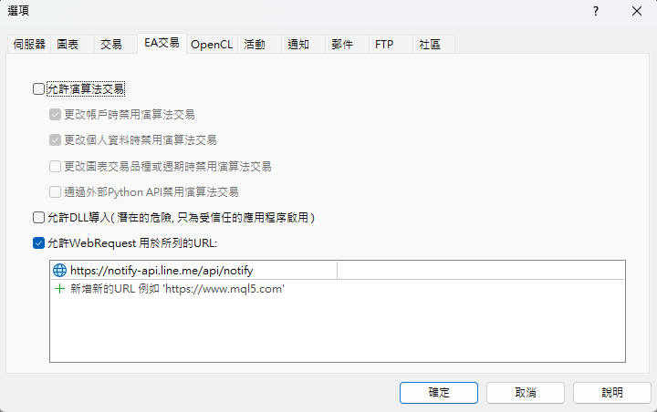
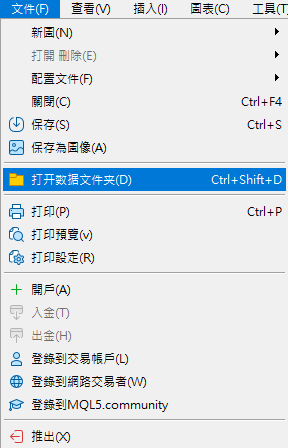
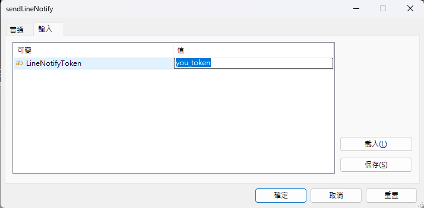

# LineNotifyMsg.mq5

這是一個 MetaTrader 5 (MT5) 指標腳本，用於在下單時發送 Line Notify 消息通知。 (另有MT4腳本,使用方式相同)

## 功能

- 當在 MT5 上進行下單操作時，會自動發送通知到 Line Notify。
- 支援 Buy 和 Sell 交易類型。
- 在通知中包含交易的商品、訂單類型、價格和交易量。

## 使用說明

### 1. 獲取 Line Notify Token

1. 前往 [Line Notify](https://notify-bot.line.me/my/) 網站。
2. 登入後，創建一個新的通知令牌 (Token)。
3. 記下生成的令牌，稍後會在腳本中使用。

### 2. 設定 MT5

1. 打開 MT5 平台，進入工具 > 設定 > EA交易。
2. 勾選 “允許 WebRequest for Listed URL”。
3. 在列表中添加以下 URL:
```
https://notify-api.line.me
```


### 3. 配置腳本

1. 將 `LineNotifyMsg.mq5` 放置到 MT5 安裝目錄的 `MQL5/Experts` 文件夾中。(可透過以下方式進入資料夾)



2. 打開腳本並在開頭部分找到以下行 or 啟動後輸入：

```mql
input string LineNotifyToken = "your_token";
```
or 另可透過啟動EA時設定



3. 將 `your_token` 替換為你在第一步中獲取的 Line Notify Token。

### 4. 編譯並運行腳本

1. 在 MT5 中，打開 MetaEditor 並打開 LineNotifyMsg.mq5 文件。
2. 編譯腳本（按 F7 或點擊工具欄中的編譯按鈕）。
3. 編譯成功後，在 MT5 平台中將該專家顧問 (EA) 添加到你的圖表中。

### 5. 測試

1. 嘗試進行一筆交易（買入或賣出）。
2. 檢查你的 Line 是否收到通知消息。

## 授權

MIT License

版權 (c) 2024 CCW

特此授權，免費向任何獲得副本的人員處理本軟件文件（“軟件”），包括但不限於使用、複製、修改、合併、出版、分發、再許可和/或銷售軟件的副本，並允許向其提供軟件的人員這樣做，具備以下條件：

上述版權聲明和本許可聲明應包含在本軟件的所有副本或主要部分中。

本軟件按“現狀”提供，不作任何明示或暗示的擔保，包括但不限於適銷性、特定用途適用性和不侵權的擔保。在任何情況下，作者或版權持有人均不對因本軟件或使用本軟件而產生的任何索賠、損害或其他責任承擔任何責任，無論在合同、侵權或其他行為中，還是由本軟件引起的或因本軟件的使用或其他交易而引起的。
